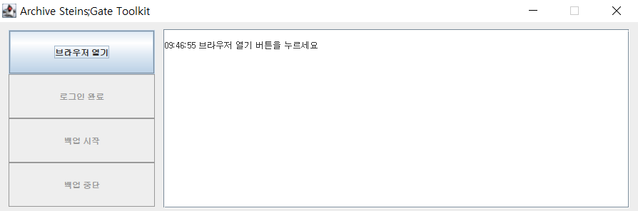

# archive-steinsgate-toolkit
Toolkit to archive NAVER Cafe Steins;Gate

## 1. 소개
	* 카페매매로 희생된 네이버 Steins;Gate 카페 백업 도구 입니다.
	* 카페매매로 변경되기 전 본래 메뉴명으로 게시글을 분류합니다.
	* 카페매매 이전에 작성된 4 ~ 20246번 글을 대상으로 합니다.
	* 본문의 이미지와 첨부파일 백업을 지원합니다. (동영상은 X)
	* 게시글을 html, png 형식으로 기록합니다.
	* 이어받기를 지원합니다.
	* Mac, Windows 호환
	
## 2. 경고
	* 백업 도구를 웹 사이트 등에 게시하지 마십시오.
	* 백업 데이터로 이득을 취하는 행위는 명백한 불법 입니다.
	* 백업 데이터를 저작자 동의없이 공개된 장소에 게시하지 마십시오.
	* 백업 도구 사용을 통해 이루어지는 모든 활동에 대한 책임은 전적으로 사용자에게 있습니다.

## 3. 사용법
1. [JRE](https://java.com/ko/download/ie_manual.jsp?locale=ko)를 설치합니다. 이미 설치한 적이 있다면 건너뜁니다.
2. 크롬 브라우저 최신버전을 설치합니다.
3. [archive-steinsgate-toolkit.zip](https://github.com/lifth-rasir/archive-steinsgate-toolkit/releases)을 다운로드 합니다.
4. archive-steinsgate-toolkit.zip의 압축을 풉니다.
5. 실행
	* archive-steinsgate-toolkit.jar 파일을 더블클릭해 실행합니다.
	* 만약 30초 이상 반응이 없다면, archive-steinsgate-toolkit.bat 파일을 더블클릭해 실행합니다.
	* 포함된 크롬 드라이버 버전은 윈도우용(chromedriver.exe) 90, M1맥용(chromedriver) 95.0.4638.17 입니다.
	* Mac 개발자로써 개발툴에서 실행하는 경우 chromedriver 우클릭 -> properties -> execute 권한 부여 후 실행하십시오.
	* 크롬 드라이버 버전 오류가 출력된다면, 호환되는 [chromedriver.exe](https://chromedriver.chromium.org/downloads)를 다운로드 받아 교체합니다.
6. 프로그램 안내에 따라 백업을 진행합니다. 트래픽 집중을 막기위해 단순계산 상 약 30시간에 거쳐 서서히 진행됩니다.
7. jar 파일과 동일한 경로에 백업 파일이 생성됩니다.
8. 이어받기
	* html파일의 끝 번호를 기준으로 이어받기 하므로, 누락분을 채우려면 그 이후 번호의 게시글 폴더를 모두 제거해야 합니다.
	* 예를 들어 4,5,7,8번 게시글을 백업하고 종료했는데, 나중에 누락된 6번을 다시 받고 싶으면 7,8번 게시글의 폴더를 제거후에 '백업시작' 버튼을 눌러야 합니다.
9. 백업 도중 창을 옮기거나, 탐색기를 여는 등 다른 작업을 해도 괜찮습니다. 단, 캡처품질에 영향을 주므로 창 사이즈 조절과 수동 스크롤은 하지 마십시오.

## 4. 주요 의존성
	* Spring Boot 2.4.4
	* selenium-java 3.141.59
	* jsoup 1.8.3
	* httpclient 4.5.13
	* simplemagic 1.16
	* ashot 1.5.4

## 5. 개발환경
	* Spring Tool Suite 4.9.0
	* Java 8
	* Windows 10 (x64)
	* macOS Big Sur 11.6 (m1)